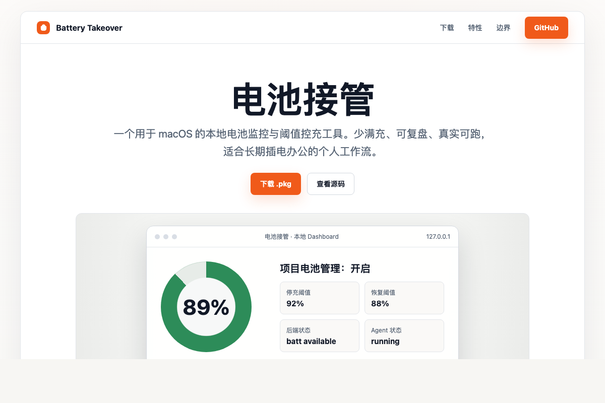

# Battery Takeover

Language: English | [简体中文](./README.zh-CN.md)

Battery Takeover is a local macOS utility for monitoring battery state and applying threshold-based charging policies. It is designed for people who keep a MacBook plugged in for long work sessions and want a simple, inspectable way to reduce time spent at 100% charge.

The project provides a lightweight command-line tool, a local Dashboard, optional LaunchAgent startup, daily reports, and a macOS `.pkg` installer.

Upgrade plan: [v0.3.0 product upgrade plan](./docs/升级规划-v0.3.0.md)

## Features

- **Battery sampling**: records current charge, AC state, charging state, cycle count, and capacity signals.
- **Threshold policy**: stops and resumes charging based on configurable upper and lower limits, such as `92 / 88`.
- **Local Dashboard**: shows current status, recent 24-hour history, runtime state, and recent actions.
- **One-click mode switch**: turn project-managed charging on or off from the Dashboard.
- **Read-only fallback**: keeps monitoring when the write backend is unavailable or an action fails.
- **Daily replay reports**: generates a local summary from recorded samples and actions.
- **LaunchAgent support**: can run the agent automatically after login.
- **Installer build**: ships as a macOS `.pkg` for easier local installation.

## Requirements

- macOS 15.x
- Apple Silicon Mac
- Python 3.11+
- A supported charging backend:
  - `batt` is the preferred backend
  - `battery` is kept as a fallback option

## Installation

### Option 1: Install from GitHub Releases

Download the latest `battery-takeover-<version>-installer.pkg` from:

[https://github.com/yishu-ziyu/battery-takeover/releases](https://github.com/yishu-ziyu/battery-takeover/releases)

Then double-click the package to install it.

The installer sets up:

- a runtime copy of the app
- a LaunchAgent
- a desktop entry named `电池接管.app`
- the local Dashboard entry point

Current packages are not signed or notarized. On first install, macOS may show a security warning.

### Option 2: Run from source

```bash
python3 -m venv .venv
source .venv/bin/activate
pip install -e .
```

## Quick Start

Check whether the local environment is ready:

```bash
./btake --config ./config/default.toml doctor
```

Initialize runtime directories:

```bash
./btake --config ./config/default.toml init
```

Collect one sample and inspect the policy decision:

```bash
./btake --config ./config/default.toml sample
./btake --config ./config/default.toml enforce --dry-run
```

Apply the policy:

```bash
./btake --config ./config/default.toml enforce
```

Start the local Dashboard:

```bash
./btake --config ./config/default.toml dashboard --open
```

Use the helper script:

```bash
./control.sh start
./control.sh status
./control.sh stop
```

## Dashboard

The Dashboard runs locally at:

[http://127.0.0.1:8775](http://127.0.0.1:8775)

It shows:

- current charge and runtime mode
- recent 24-hour battery curve
- latest sample and latest action
- active charging backend
- LaunchAgent status
- stop and resume thresholds
- project-managed charging switch
- manual policy execution


## Charging Modes

Battery Takeover has two explicit operating modes:

### Project-managed charging: on

The policy engine applies the configured stop and resume thresholds. This is the usual mode for long plugged-in sessions, for example:

```text
stop at 92%
resume at 88%
```

### Project-managed charging: off

The project clears its charging limit and returns control to the system and the underlying backend. This is useful before leaving with the laptop, when charging to 100% is desired.

In the Dashboard, **Save settings and apply now** persists the configuration and immediately applies the selected mode.

## Daily Reports

Generate a local daily report:

```bash
./btake --config ./config/default.toml report daily
```

Reports are written under the configured reports directory.

## Startup and Desktop Entry

Install the LaunchAgent:

```bash
./install_agent_launchd.sh
```

Install the desktop app entry:

```bash
./install_desktop_app.sh
```

Generated app entries:

- `~/Applications/电池接管.app`
- `~/Desktop/电池接管.app`

Uninstall:

```bash
./uninstall_desktop_app.sh
./uninstall_agent_launchd.sh
```

## Troubleshooting

If `doctor` reports that the backend is unavailable, check the backend directly:

```bash
batt status
```

Common cases:

- `batt daemon is not running`: start or reinstall the `batt` daemon.
- socket or permission errors: repair the backend daemon permissions according to the backend documentation.
- read-only mode: sampling still works, but Battery Takeover will not attempt write actions until the environment is safe again.

## Scope and Safety Notes

Battery Takeover works within the capabilities exposed by macOS and the configured backend. It does not claim to provide hardware-level battery bypass or hardware-level power-source switching.

The current implementation manages charging behavior by asking the backend to stop or resume charging at configured thresholds. When the backend is missing, unavailable, or returns errors, the project falls back to monitoring instead of forcing control.

The Dashboard binds to loopback hosts only. It is intended as a local control surface, not a network-exposed service.

## Development

Run tests:

```bash
PYTHONPATH=src python3 -m unittest discover -s tests -v
```

Build the installer:

```bash
./build_macos_installer.sh
```

Default installer output:

```bash
./dist/battery-takeover-<version>-installer.pkg
```

Release page assets:

- [Release page HTML](./docs/release-page.html)
- [Desktop preview](./docs/assets/release/release-page-desktop.png)
- [Mobile preview](./docs/assets/release/release-page-mobile.png)

## Documentation

- [Changelog](./CHANGELOG.md)
- [Product notes](./docs/产品文档.md)
- [Development log](./docs/开发日志.md)
- [Research baseline](./调研-开源与产品基线.md)

## License

MIT
