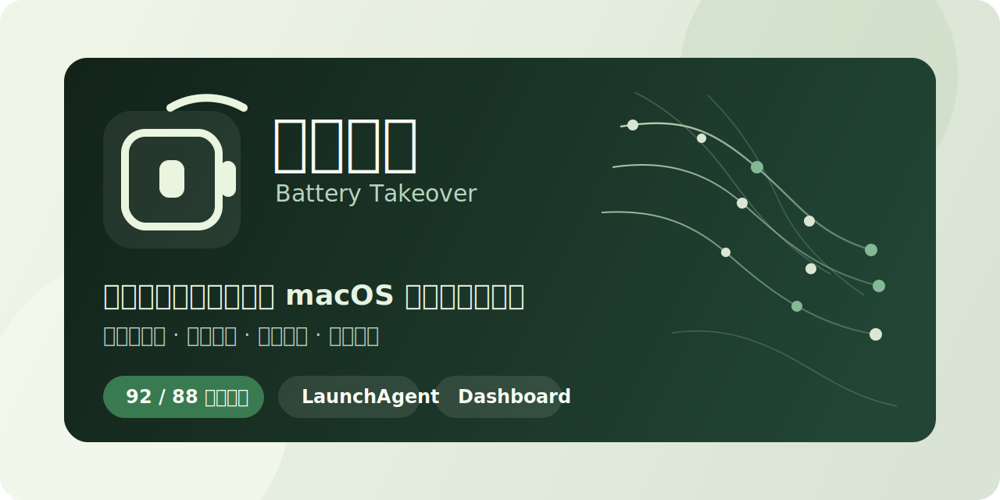
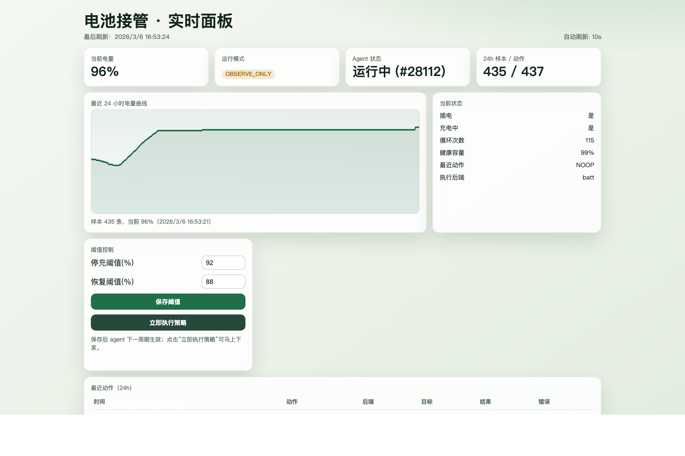

# 电池接管（Battery Takeover）

`电池接管` 是一个面向 macOS 的本地电池监控与阈值控充工具。它基于系统可见状态采样与第三方后端执行能力，在允许范围内将电池维持在目标区间，并保留完整的样本、动作与运行状态记录。

项目当前提供：
- 分钟级采样
- 阈值控充
- 降级只读保护
- 日报复盘
- 本地 Dashboard
- LaunchAgent 开机自启
- `.pkg` 安装包

## 项目边界

- 本项目不宣称提供“物理旁路电池”能力。
- 当前实现的本质是“停止继续充电并维持区间”，而不是硬件级电源切换。
- 写入能力依赖第三方后端；当前优先兼容 `batt`，`battery` 为备选。
- 当后端不可用、执行失败或环境不满足要求时，系统会退回到只读监控。

## 运行模式

项目支持两种明确模式：

- `项目电池管理：开启`
  - 按配置阈值执行控充
  - 典型场景是长期插电办公，例如 `92 / 88`
- `项目电池管理：关闭`
  - 主动清除项目设置的充电限制
  - 将充电行为交还给系统与底层后端
  - 典型场景是出门前希望充到 `100%`

Dashboard 中的“保存设置并立即应用”会在保存后立刻下发对应动作，而不是仅修改配置文件。

## 系统要求

- macOS 15.x
- Apple Silicon
- Python 3.11+
- 可用的 `batt` 或 `battery` 后端

## 安装

### 方式一：直接安装

从 GitHub Releases 下载 `battery-takeover-<version>-installer.pkg` 后双击安装。

安装完成后会自动：
- 安装运行副本
- 配置 LaunchAgent
- 创建桌面入口 `电池接管.app`
- 打开本地界面

Releases:
- [https://github.com/yishu-ziyu/battery-takeover/releases](https://github.com/yishu-ziyu/battery-takeover/releases)

说明：
- 当前安装包未做开发者签名与 notarization。
- 首次安装时，macOS 可能显示安全提示。

### 方式二：源码运行

```bash
python3 -m venv .venv
source .venv/bin/activate
pip install -e .
```

## 快速开始

### 1. 环境体检

```bash
./btake --config ./config/default.toml doctor
```

### 2. 初始化

```bash
./btake --config ./config/default.toml init
```

### 3. 采样与策略验证

```bash
./btake --config ./config/default.toml sample
./btake --config ./config/default.toml enforce --dry-run
./btake --config ./config/default.toml enforce
```

### 4. 启动本地 Dashboard

```bash
./btake --config ./config/default.toml dashboard --open
```

### 5. 使用统一入口脚本

```bash
./control.sh start
./control.sh status
./control.sh stop
```

## Dashboard

Dashboard 提供以下能力：
- 查看最近 24 小时电量曲线
- 查看当前采样、最近动作、执行后端与 Agent 状态
- 调整停充阈值与恢复阈值
- 切换“项目电池管理”开关
- 立即执行一次策略

默认地址：
- [http://127.0.0.1:8765](http://127.0.0.1:8765)

实时界面示例：



## 开机自启与桌面入口

安装 LaunchAgent：

```bash
./install_agent_launchd.sh
```

安装桌面入口：

```bash
./install_desktop_app.sh
```

安装后会生成：
- `~/Applications/电池接管.app`
- `~/Desktop/电池接管.app`

卸载：

```bash
./uninstall_desktop_app.sh
./uninstall_agent_launchd.sh
```

## 常用命令

```bash
./btake --config ./config/default.toml doctor
./btake --config ./config/default.toml status
./btake --config ./config/default.toml report daily
batt status
```

## 故障排查

如果 `doctor` 显示后端不可用，优先检查：

```bash
batt status
```

常见问题：
- `batt daemon is not running`
  - 说明 `batt` 守护进程未正常运行
- socket 或权限错误
  - 需要按 `batt` 官方方式修正 daemon 权限或服务安装
- `doctor` 退化为只读
  - 说明当前环境允许采样，但不满足安全写入条件

## 测试

```bash
PYTHONPATH=src python3 -m unittest discover -s tests -v
```

## 打包

```bash
./build_macos_installer.sh
```

默认产物：

```bash
./dist/battery-takeover-<version>-installer.pkg
```

## 文档

- [Changelog](./CHANGELOG.md)
- [产品文档](./docs/产品文档.md)
- [开发日志](./docs/开发日志.md)
- [调研基线](./调研-开源与产品基线.md)

## License

MIT
